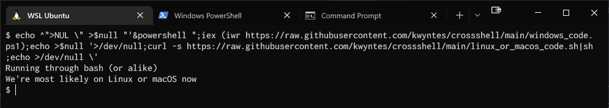
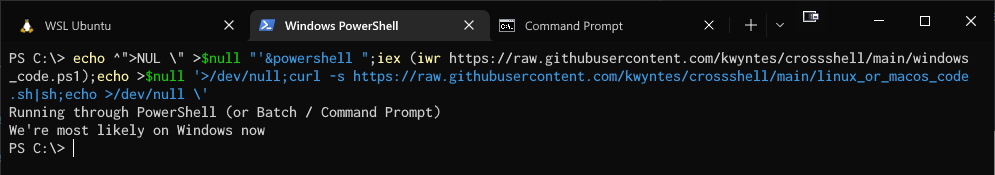
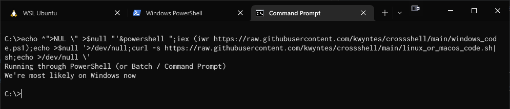

# Cross(s)hell
A single shell snippet that works in Bash, PowerShell and Command Prompt.

```
echo ^">NUL \" >$null "'&powershell ";iex (iwr __WINDOWS_SCRIPT_URL__);echo >$null '>/dev/null;curl -s __LINUX_OR_MACOS_SCRIPT_URL__|sh;echo >/dev/null \'
```

<br>


### In theory, the script

* on Windows<sup>1</sup> downloads and runs [`windows_code.ps1`](windows_code.ps1).
* on Linux/macOS<sup>2</sup> downloads and runs [`linux_or_macos_code.sh`](linux_or_macos_code.sh).

##### 1. Note there exists a cross-platform PowerShell nowadays, so technically speaking you should still do an OS check there - but realistically speaking, who uses that anyway?
##### 2. ... or any OS that runs a bash-like shell (yeah it could even be Windows through Git Bash or something)


### In practice, it works!

#### sh


#### PowerShell


#### Command Prompt


<br>


## The script

#### With Bash syntax highlighting
```bash
echo ^">NUL \" >$null "'&powershell ";iex (iwr https://raw.githubusercontent.com/kwyntes/crossshell/main/windows_code.ps1);echo >$null '>/dev/null;curl -s https://raw.githubusercontent.com/kwyntes/crossshell/main/linux_or_macos_code.sh|sh;echo >/dev/null \'
```
#### With PowerShell syntax highlighting
```powershell
echo ^">NUL \" >$null "'&powershell ";iex (iwr https://raw.githubusercontent.com/kwyntes/crossshell/main/windows_code.ps1);echo >$null '>/dev/null;curl -s https://raw.githubusercontent.com/kwyntes/crossshell/main/linux_or_macos_code.sh|sh;echo >/dev/null \'
```
#### With Batch syntax highlighting
```batch
echo ^">NUL \" >$null "'&powershell ";iex (iwr https://raw.githubusercontent.com/kwyntes/crossshell/main/windows_code.ps1);echo >$null '>/dev/null;curl -s https://raw.githubusercontent.com/kwyntes/crossshell/main/linux_or_macos_code.sh|sh;echo >/dev/null \'
```

<br>

Note that the syntax highlighter doesn't actually understand what's going on either.

<br>


## How does it work?

**Short answer**: By abusing almost every single syntax feature of each shell.

<br>

**Long answer:** Here's an almost-character-by-character explanation of the whole script:

<!-- GitHub markdown doesn't support colspan sadly -->
<table>
  <tr>
    <th>Character sequence</th>
    <th>Bash interpretation</th>
    <th>PowerShell interpretation</th>
    <th>Command Prompt interpretation</th>
  </tr>

  <tr>
    <td><code>echo</code></td>
    <td colspan=3 align=center>Echo command</td>
  </tr>
  <tr>
    <td><code>^"</code></td>
    <td colspan=2 align=center>Echo <code>^</code> and begin doubleq string literal</td>
    <td>Echo <code>"</code> (<code>^</code> is the escape character)</td>
  </tr>
  <tr>
    <td><code>>NUL</code></td>
    <td colspan=2 align=center>&lt;Inside doubleq string literal&gt;</td>
    <td>Redirect output to <code>NUL</code> (discard)</td>
  </tr>
  <tr>
    <td><code>\"</code></td>
    <td>"</td>
    <td>Echo <code>\</code> and end doubleq literal</td>
    <td>Echo <code>\</code> and begin string literal<sup>3</sup></td>
  </tr>
  <tr>
    <td><code>>$null</code></td>
    <td>"</td>
    <td>Redirect output to <code>$null</code> (discard)</td>
    <td>&lt;Inside string literal&gt;</td>
  </tr>
  <tr>
    <td><code>"</code></td>
    <td>End doubleq string literal</td>
    <td>Begin doubleq string literal</td>
    <td>End string literal</td>
  </tr>
  <tr>
    <td><code>'</code></td>
    <td>Begin singleq string literal</td>
    <td>&lt;Inside doubleq string literal&gt;</td>
    <td>Echo <code>'</code></td>
  </tr>
  <tr>
    <td><code>&</code></td>
    <td>&lt;Inside singleq string literal&gt;</td>
    <td>"</td>
    <td>Command seperator</td>
  </tr>
  <tr>
    <td><code>powershell</code></td>
    <td>"</td>
    <td>"</td>
    <td>Execute <code>powershell</code> ...</td>
  </tr>
  <tr>
    <td><code>"</code></td>
    <td>"</td>
    <td>End doubleq string literal</td>
    <td>Begin string literal</td>
  </tr>
  <tr>
    <td><code>;</code></td>
    <td>"</td>
    <td>Command seperator</td>
    <td><em>Parsed by PowerShell</em></td>
  </tr>
  <tr>
    <td><code>iex (iwr URL)</code></td>
    <td>"</td>
    <td>Download <a href="windows_code.ps1">script</a> and execute it</td>
    <td>"</td>
  </tr>
  <tr>
    <td><code>;</code></td>
    <td>"</td>
    <td>Command seperator</td>
    <td>"</td>
  </tr>
  <tr>
    <td><code>echo >$null</code></td>
    <td>"</td>
    <td>Echo and redirect to <code>$null</code></td>
    <td>"</td>
  </tr>
  <tr>
    <td><code>'</code></td>
    <td>End singleq string literal</td>
    <td>Begin singleq string literal</td>
    <td>"</td>
  </tr>
  <tr>
    <td><code>>/dev/null</code></td>
    <td>Redirect output to <code>/dev/null</code> (discard)</td>
    <td>"</td>
    <td>"</td>
  </tr>
  <tr>
    <td><code>;</code></td>
    <td>Command seperator</td>
    <td>"</td>
    <td>"</td>
  </tr>
  <tr>
    <td><code>curl -s URL|sh</code></td>
    <td>Download <a href="linux_or_macos_code.sh">script</a> and execute it</td>
    <td>"</td>
    <td>"</td>
  </tr>
  <tr>
    <td><code>;</code></td>
    <td>Command seperator</td>
    <td>"</td>
    <td>"</td>
  </tr>
  <tr>
    <td><code>echo >/dev/null</code></td>
    <td>Echo and redirect to <code>/dev/null</code></td>
    <td>"</td>
    <td>"</td>
  </tr>
  <tr>
    <td><code>\'</code></td>
    <td>Echo <code>'</code></td>
    <td>End singleq string literal</td>
    <td>"</td>
  </tr>
  <!-- OLD VERSION <tr>
    <td><code>^"</code></td>
    <td>Echo <code>^</code> and begin string literal</td>
    <td><code>^</code> into string literal and end literal</td>
    <td>Echo <code>"</code></td>
  </tr>
  <tr>
    <td><code>;</code></td>
    <td>&lt;Inside string literal&gt;</td>
    <td>Command seperator</td>
    <td>Echo <code>;</code></td>
  </tr>
  <tr>
    <td><code>&</code></td>
    <td>&lt;Inside string literal&gt;</td>
    <td>Invocation operator</td>
    <td>Command seperator</td>
  </tr>
  <tr>
    <td><code>powershell ...</code></td>
    <td>&lt;Inside string literal&gt;</td>
    <td colspan=2 align=center>Execute <code>powershell exit;iex (iwr _SCRIPT_URL_)</code></td>
  </tr>
  <tr>
    <td><code>;&</code></td>
    <td colspan=3 align=center>[Same thing as before]</td>
  </tr>
  <tr>
    <td><code>echo</code></td>
    <td>&lt;Inside string literal&gt;</td>
    <td colspan=2 align=center>Echo command</td>
  </tr>
  <tr>
    <td><code>'</code></td>
    <td>&lt;Inside string literal&gt;</td>
    <td>Begin string literal (single quotes)</td>
    <td>Echo <code>'</code></td>
  </tr>
  <tr>
    <td><code>>NUL</code></td>
    <td colspan=2 align=center>&lt;Inside string literal&gt;</td>
    <td>Redirect output to <code>NUL</code> (discard)</td>
  </tr>
  <tr>
    <td><code>'</code></td>
    <td>&lt;Inside string literal&gt;</td>
    <td>End string literal (single quotes)</td>
    <td>Echo <code>'</code></td>
  </tr>
  <tr>
    <td><code>'</code></td>
    <td>&lt;Inside string literal&gt;</td>
    <td>Begin string literal (single quotes)</td>
    <td>Echo <code>'</code></td>
  </tr>
  <tr>
    <td><code>"</code></td>
    <td>End string literal</td>
    <td colspan=2 align=center>Begin string literal</td>
  </tr>
  <tr>
    <td><code>>/dev/null</code></td>
    <td>Redirect output to <code>/dev/null</code> (discard)</td>
    <td colspan=2 align=center>&lt;Inside string literal&gt;</td>
  </tr>
  <tr>
    <td><code>;</code></td>
    <td>Command seperator</td>
    <td colspan=2 align=center>&lt;Inside string literal&gt;</td>
  </tr>
  <tr>
    <td><code>curl -s ...</code></td>
    <td>Execute <code>curl -s _SCRIPT_URL_ | sh</code></td>
    <td colspan=2 align=center>&lt;Inside string literal&gt;</td>
  </tr>
  <tr>
    <td><code>;</code></td>
    <td>Command seperator</td>
    <td colspan=2 align=center>&lt;Inside string literal&gt;</td>
  </tr>
  <tr>
    <td><code>echo</code></td>
    <td>Echo command</td>
    <td colspan=2 align=center>&lt;Inside string literal&gt;</td>
  </tr>
  <tr>
    <td><code>>/dev/null</code></td>
    <td>Redirect output to <code>/dev/null</code> (discard)</td>
    <td colspan=2 align=center>&lt;Inside string literal&gt;</td>
  </tr>
  <tr>
    <td><code>\"</code></td>
    <td>Echo <code>"</code></td>
    <td colspan=2 align=center><code>\</code> into string literal and end it</td>
  </tr>
  <tr>
    <td><code>\`"</code></td>
    <td>Echo <code>`</code> and begin string literal</td>
    <td>Echo <code>\"</code> (<code>`</code> is the escape character)</td>
    <td>Echo <code>\`</code> and begin string literal</td>
  </tr> -->
</table>

##### 3. Command Prompt doesn't seem to behave consistently with string literals so I'm honestly not exactly sure why this works. It also does not feature single-quoted string literals.
